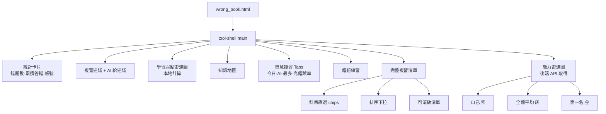

# 錯題本與老師報表 — 頁面設計圖與需求文件

> 適用於 `wrong_book.html` 與 `teacher_report.html` 兩個重點頁面。
> 本文件涵蓋頁面結構、功能需求、與後端 API 對照表。

---

## 1. `/wrong_book.html` 頁面設計圖

### 1.1 整體版面結構（文字 wireframe）

```
錯題本頁面 (main.tool-shell)
├─ 頂部返回列 (tool-topbar)
│   ├─ 返回首頁按鈕
│   └─ 標題：我的錯題本
│
├─ 未登入警示（#wbLoginWarn，未登入時才顯示）
│
├─ 統計卡片 (summary-grid)
│   ├─ 錯題數         (#wrongItemCount)
│   ├─ 累積答錯       (#wrongTotalCount)
│   └─ 目前帳號       (#wrongUserName)
│
├─ 複習建議 (tool-card)
│   ├─ 學習狀況洞察   (#wrongBookInsight)
│   └─ AI 給建議      (#aiAdviceBox)
│
├─ 學習弱點雷達圖 (tool-card)
│   ├─ Canvas (#weaknessRadar)
│   └─ 圖例 (#weaknessRadarLegend)
│
├─ 知識地圖 (tool-card)
│   └─ 各主題掌握狀況 (#knowledgeMapArea)
│
├─ 智慧複習 Tabs (tool-card)
│   ├─ 今日複習      (data-tab="today")
│   ├─ AI 推薦        (data-tab="ai-rec")
│   ├─ 最常答錯      (data-tab="most-wrong")
│   ├─ 高錯誤率      (data-tab="high-err")
│   └─ 內容區         (#wb-review-panel)
│
├─ 錯題練習 (tool-card)
│   ├─ 開始練習按鈕   (#startPracticeBtn)
│   └─ 練習區         (#wrongPracticeBox)
│
├─ 完整複習清單 (tool-card)  ★ 本次重點
│   ├─ 科目篩選 chips (#wbSubjectFilterRow)
│   │   全部 / 國文 / 英文 / 數學 / 自然 / 社會 / 程式 / 其他
│   ├─ 排序方式       (#wbSortSelect)
│   │   最近錯誤 / 答錯最多次 / 難度高→低 / 標題排序
│   ├─ 顯示題數提示   (#wbFilterCount)  ex. (顯示 12 / 35 題)
│   └─ 可滾動清單     (#wrongBookListScroll → #wrongBookList)
│         max-height: 680px (桌機) / 560px (手機)
│         overflow-y: auto
│
└─ 能力雷達圖 (tool-card)  ★ 本次重點：移回 tool-shell
    ├─ 查詢帳號 input (#abilityRadarPlayerInput)
    ├─ 重新查詢按鈕   (#abilityRadarReloadBtn)
    ├─ Legend：自己 / 全體平均 / 第一名
    ├─ Canvas         (#analytics-radar-canvas)
    └─ 空狀態         (#abilityRadarEmpty)
        「目前沒有比賽紀錄，完成遊戲後會產生能力分析」
```

### 1.2 視覺結構（Mermaid）



---

## 2. `/wrong_book.html` 功能需求

| # | 功能 | 行為說明 |
|---|------|----------|
| 1 | **錯題讀取** | 進站自動呼叫 `/wrong_book_summary?username=<currentUser>`；若 API 失敗會 fallback 到 `localStorage.quizarena_wrong_book_<user>` |
| 2 | **科目篩選** | 來源優先序：`item.category` → `item.sourceBankTitle` → `resolveSubjectLabel(item)` 對照表。可選：全部 / 國文 / 英文 / 數學 / 自然 / 社會 / 程式 / 其他 |
| 3 | **滾動清單** | `#wrongBookListScroll`：`max-height:680px`（手機 560px）、`overflow-y:auto`，仍保留卡片間距與玻璃風格 |
| 4 | **排序方式** | 最近錯誤 / 答錯最多次 / 難度高→低 / 標題排序 |
| 5 | **AI 解析** | 每張卡片有「AI 解題講解」按鈕；呼叫 `/ai_tutor`；解析存進 `item.aiExplanation` |
| 6 | **筆記儲存** | 每張卡片附筆記欄；存到 `localStorage.quizarena_note_<user>_<id>` |
| 7 | **錯題練習** | 按「開始練習」洗牌錯題、逐題作答、可呼 AI 家教講解 |
| 8 | **學習弱點雷達圖** | 本地依科目／難度／題型計算，繪在 `<canvas id="weaknessRadar">` |
| 9 | **能力雷達圖** | 呼 `/api/radar/<player>` 取得「自己／全體平均／第一名」三維資料；用 Chart.js 繪製。**等 Chart.js 載入完成才初始化** |
| 10 | **無資料狀態** | 能力雷達圖在 API 錯誤或 `self` 全 0 時顯示「目前沒有比賽紀錄，完成遊戲後會產生能力分析」 |
| 11 | **未登入狀態** | `currentUser` 取不到時顯示登入提醒、不會誤抓 `playerName` 或 `guest` |
| 12 | **時間顯示** | 一律以 `Asia/Taipei` 顯示；後端 `lastWrongAt` 是「秒級」timestamp，前端用 `Number(ts) > 1e12 ? ts : ts*1000` 自動偵測 |

### 帳號判定規則（重點）

```text
登入帳號（currentUser） ← 主要，用於 /wrong_book_summary
   ↓
玩家暱稱（playerName）   ← 只用於房間遊戲顯示
                          ✗ 不可用於查錯題本
```

優先序：
1. `localStorage.currentUser`
2. `sessionStorage.currentUser`
3. `currentUserProfile.username`
4. `qa_profile_cache.username`

取不到時：顯示登入提醒，不誤抓 `guest` 或 `playerName`。

---

## 3. `/teacher_report.html` 頁面設計圖

### 3.1 整體版面結構

```
老師模式頁面 (main.tool-shell.teacher-report-page)
├─ 頂部返回列
│
├─ 房間搜尋區 (tool-card.report-search)
│   ├─ PIN 輸入框    (#reportPinInput)
│   ├─ 查看報表按鈕   (#loadReportBtn)
│   ├─ 匯出 CSV       (#downloadCsvBtn)
│   ├─ 匯出 Excel     (#downloadExcelReportBtn)
│   └─ 匯出 HTML      (#downloadHtmlReportBtn)
│
├─ 建房紀錄 (tool-card)
│   ├─ 重新整理按鈕
│   └─ 紀錄列表       (#reportHistoryList)
│
├─ 統計卡片 (summary-grid)
│   ├─ 房間 / 學生數 / 題目數
│   └─ 平均正確率 / 平均分數 / 需關注學生
│
├─ 圖表分析 (tool-card)
│   └─ #reportAnalysisPanel
│
├─ 學生表現 (tool-card)
│   └─ #studentReportList (表格)
│
├─ 題目答對率 (tool-card)
│   └─ #questionReportList
│
└─ 進階分析儀表板 (tool-card.analytics-dashboard) ★ 包進 tool-shell
    ├─ 標題列：房間選擇 (#analytics-room-select)
    └─ Tabs (data-tab)
        ├─ 班級總覽 overview
        │   ├─ 統計格 / 正確率分布 chart / 學生狀態
        │   └─ 空狀態 (.analytics-empty[data-empty-for="overview"])
        ├─ 個別學生 student
        │   ├─ 學生列表 + 詳情面板
        │   └─ 空狀態
        ├─ 弱題分析 weak
        │   ├─ 各題錯誤率 bar chart
        │   ├─ 弱題明細
        │   └─ 空狀態
        ├─ AI 建議 ai
        │   ├─ 學生卡片 + 生成建議
        │   └─ 空狀態
        └─ 家長報告 parent
            ├─ 學生選擇 + 生成按鈕
            ├─ 報告連結
            └─ 空狀態
```

### 3.2 老師報表流程

```mermaid
flowchart LR
    A[老師進入頁面] --> B[輸入 PIN<br/>或選擇建房紀錄]
    B --> C[/teacher_report]
    C --> D[頂部統計]
    C --> E[圖表分析]
    C --> F[學生表現表格]
    C --> G[題目答對率]
    A --> H[進階分析:選房間]
    H --> I[/api/recent-rooms]
    H --> J[/api/teacher/overview]
    J --> K[班級總覽]
    J --> L[個別學生詳情<br/>/api/teacher/student]
    H --> M[/api/teacher/weak-questions]
    M --> N[弱題分析]
    H --> O[/api/teacher/ai-suggestion]
    O --> P[AI 建議]
    H --> Q[/api/teacher/parent-report]
    Q --> R[家長報告連結]
```

### 3.3 房間切換時必須同步更新

切換 `#analytics-room-select` 時要一次更新：
- 班級總覽（`loadOverview` → `/api/teacher/overview/<room_id>`）
- 弱題分析（`loadWeakQuestions` → `/api/teacher/weak-questions/<room_id>`）
- 個別學生（重置 `#student-list` 與 `#student-detail-panel`）
- AI 建議（重新填充 `#ai-cards-container`）
- 家長報告（重置 `#parent-student-select` 選項）
- 上方主報表（若 `room_id` 是 6 位數 PIN，自動填入 `#reportPinInput` 並查詢）

各 panel 在沒選房間或 API 沒資料時，顯示 `.analytics-empty` 空狀態提示。

---

## 4. API 對照表

### 4.1 錯題本 (`wrong_book.html`)

| API | 方法 | 用途 | 觸發處 |
|-----|------|------|--------|
| `/wrong_book_summary?username=<user>` | GET | 載入錯題清單與累積答錯次數 | 進站 / `#refreshWrongBookBtn` |
| `/story_wrong_question` | POST | 故事模式答錯時自動寫入錯題本 | 故事模式內部呼叫 |
| `/api/wrong-book?player_name=<user>` | GET | 另一份錯題本 API（保留向後相容） | 部分舊頁面 |
| `/api/radar/<player_name>` | GET | 取得能力雷達資料：自己 / 平均 / 第一名 | 能力雷達圖區塊 |
| `/ai_tutor` | POST | AI 解題講解 | 每題「AI 解題講解」按鈕 / 練習區 AI 家教 |
| `/sync_wrong_book` | POST | 將 legacy localStorage 錯題同步進後端 | 進站 `create_home.js` fire-and-forget |
| `/profile_summary?username=<user>` | GET | 個人資料 modal 整合資料 | profile modal show 事件 |

### 4.2 老師報表 (`teacher_report.html`)

| API | 方法 | 用途 |
|-----|------|------|
| `/teacher_report?pin=<pin>` | GET | 取得房間完整報表（學生、題目、作答明細） |
| `/teacher_report_history` | GET | 取得建房紀錄列表 |
| `/api/recent-rooms` | GET | 進階分析儀表板的房間下拉資料 |
| `/api/teacher/overview/<room_id>` | GET | 班級總覽：學生狀態、平均正確率、需輔導名單 |
| `/api/teacher/student/<room_id>/<student_name>` | GET | 個別學生詳情：排名、各科分數、弱科 |
| `/api/teacher/weak-questions/<room_id>` | GET | 全班弱題：錯誤率排行 |
| `/api/teacher/ai-suggestion` | POST | 對單一學生產生個人化 AI 建議 |
| `/api/teacher/parent-report` | POST | 產生家長報告 URL |
| `/api/parent-report/<token>` | GET | 家長端讀取報告 |

### 4.3 統一錯題本帳號規則

```text
錯題本 API（/wrong_book_summary, /story_wrong_question, /sync_wrong_book）
  → 一律使用「登入帳號 username」
  → 不接受 playerName 或 displayName
```

---

## 5. 變更摘要（本次修正）

1. **`/wrong_book.html` 完整複習清單**：新增科目篩選 chips、排序下拉、滾動容器（680px / 手機 560px）。
2. **能力雷達圖**：移回 `<main class="tool-shell">` 內；新增帳號輸入框、Chart.js 載入完成才初始化、API 錯誤與無資料時顯示提示。
3. **今日複習日期判斷**：`lastWrongAt` 是秒級 timestamp，前端統一 `Number(ts) > 1e12 ? ts : ts*1000`；時間顯示固定 Asia/Taipei。
4. **AI tutor payload 去重**：刪除 `loadAiTutor()` 內重複的 `explanation` / `language` 欄位。
5. **帳號判定統一**：`wrong_book.html` / `wrong_book.js` 一律以 `currentUser` 為主、不再讀 `playerName`，未登入時顯示提醒。
6. **後端新增 `/sync_wrong_book`**：將 legacy localStorage 錯題同步至 `wrong_question_book`，並回傳 `synced/skipped/total` 統計。
7. **後端新增 `/profile_summary`**：整合 `build_user_profile / build_achievement_summary / build_wrong_book_detail / build_friends_overview` 一次回傳。
8. **`create_htme.js` 已合併並改名為 `create_home.js`**：保留功能較完整的版本（草稿快取、`getStoredUser`、`mergeLoadedBanks` 等）；新版另外加上 legacy 同步呼叫；`create_home.html` 已改為引用 `create_home.js`；舊檔已刪除。
9. **`/teacher_report.html` 進階分析儀表板**：包進 `main.tool-shell` 內、加上 `analytics-dashboard` 包裝；切換房間時同步更新所有分頁；每個分頁有 `.analytics-empty` 空狀態；圖表載入失敗時顯示錯誤訊息；Chart.js 載入完成才初始化。
